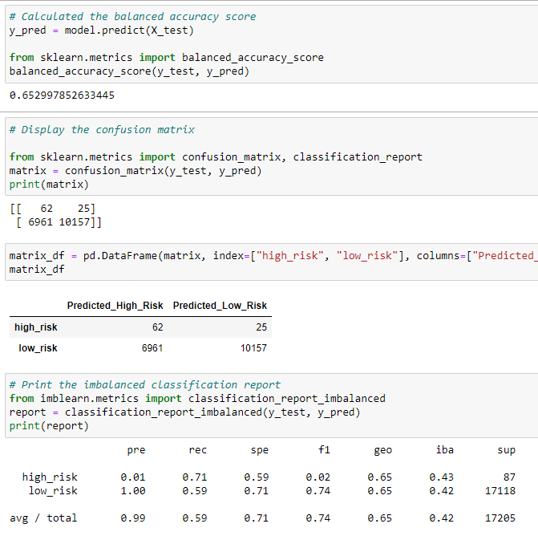
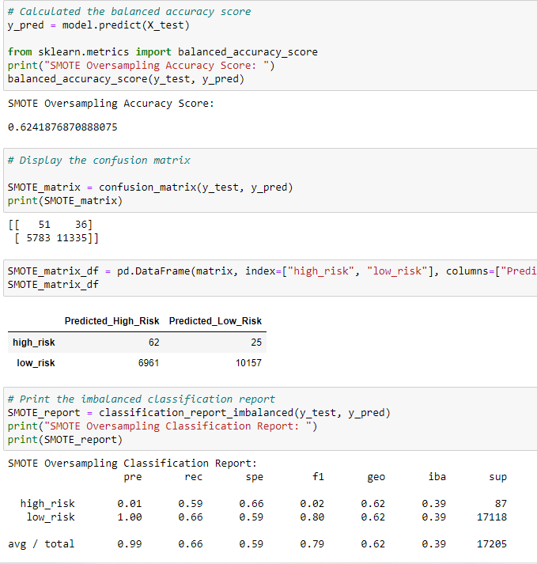
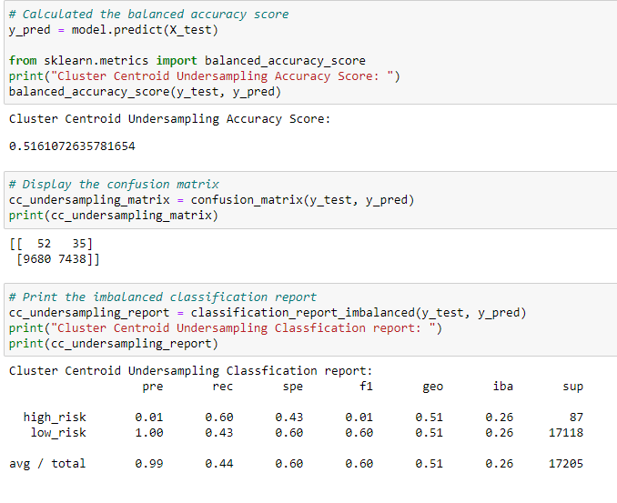
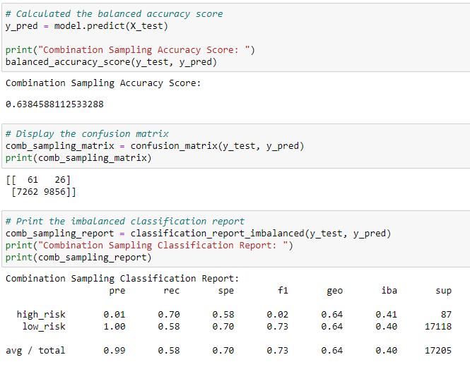
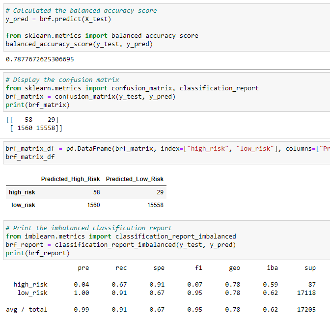
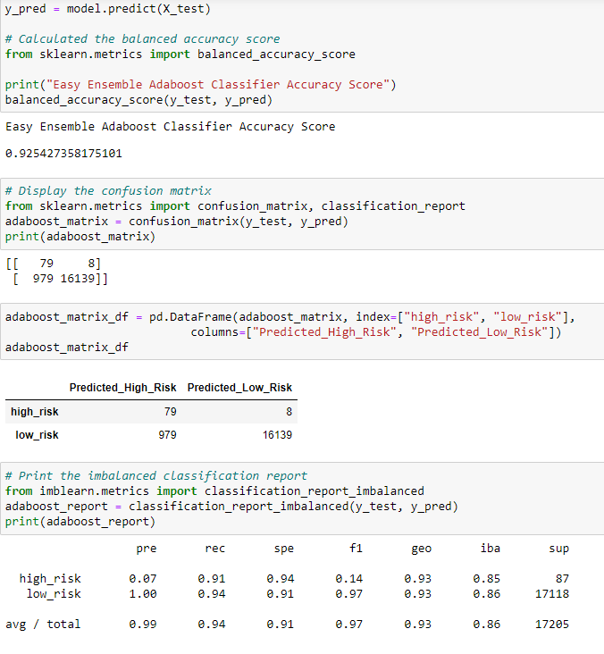

# Credit_Risk_Analysis
## Overview of the Analysis:
Apply machine learning to solve a real-world challenge: Credit card risk.
Credit risk is an inherently unbalanced classification problem, as good loans easily outnumber risky loans. 
Therefore, I need to employ different techniques to train and evaluate models with unbalanced classes.
Jill asked us to use imbalanced-earn and scikit-learn libraries to build and evaluate models using resampling

## Results:
### Random Naive Sampling
- Accuracy Score: 0.65
- Precision Score - High risk: 0.01, Low risk: 1.00
- Recall Score - High risk: 0.71, Low risk: 0.59
- F1 score: 0.74

### SMOTE Oversampling
- Accuracy Score: 0.62
- Precision Score - High risk: 0.01, Low risk: 1.00
- Recall Score - High risk: 0.59, Low risk: 0.66
- F1 score: 0.79

### Undersampling
- Accuracy Score: 0.52
- Precision Score - High risk: 0.01, Low risk: 1.00
- Recall Score - High risk: 0.60, Low risk: 0.43
- F1 score: 0.60

### Combination Sampling
- Accuracy Score: 0.64
- Precision Score - High risk: 0.01, Low risk: 1.00
- Recall Score - High risk: 0.70, Low risk: 0.58
- F1 score: 0.73

### Balanced Random Foreset Classifier
- Accuracy Score: 0.79
- Precision Score - High risk: 0.04, Low risk: 1.00
- Recall Score - High risk: 0.67, Low risk: 0.91
- F1 score: 0.95

### Easy Ensemble AdaBoost Classifier
- Accuracy Score: 0.93
- Precision Score - High risk: 0.07, Low risk: 1.00
- Recall Score - High risk: 0.91, Low risk: 0.94
- F1 score: 0.97

## Summary: 
When it comes to credit risk, we need to consider Accuracy score and Precision score of models to help lenders minimize high risk borrowers, and so my analysis
would definitely help the lenders how to look at each model to make their decisions.

I would recommend Ensemble AdaBoost Classifier first, because it has highest accuracy score of 93%, which means that this model has highest accuracy among 
all of the models. Also its precision score of high risk was 7% and it means that this AdaBoost Classifier had highest precision in identifying high-risk borrowers.
Its F1 score (97%) was also the highest F1 score among all models and it means there is a good balance between precision and sensitivity in this model.

I would recommend Balanced Random Forest Classifier as second because their accuracy score was 79% which was the second highest accuracy score. 
Also its precision score of high risk was 4% and it was the second highest precision in identifying high-risk borrowers.
Its F1 score (95%) was also the second highest F1 score.

Unfortunately, SMOTE Oversampling, Undersampling, and Combination Sampling models were not as accurate as the top 2 models I recommended and 
they had lowest precision scores. 

